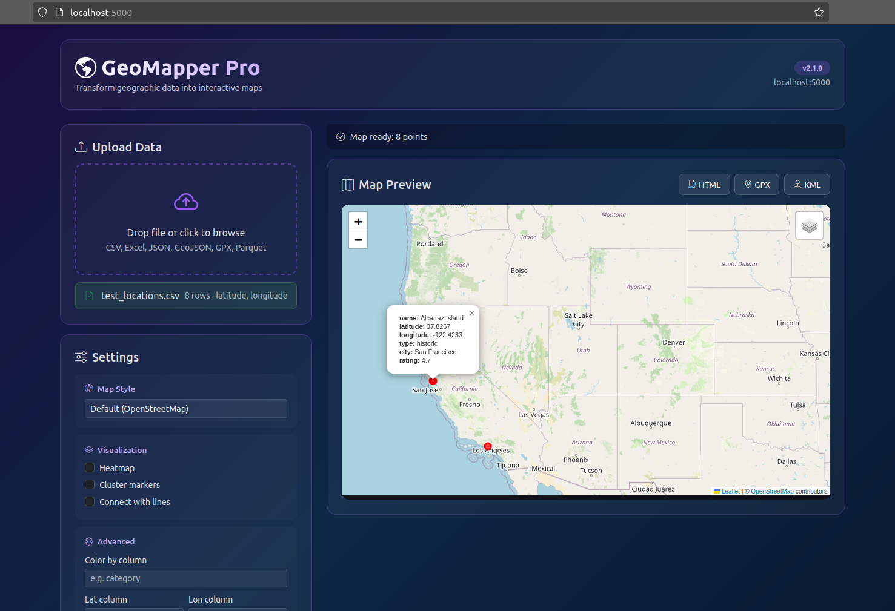
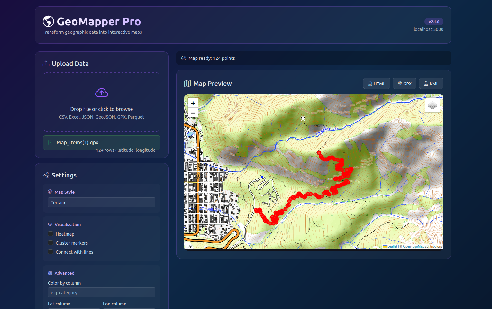

# 🗺️ GeoMapper Pro

> **Transform your geographic data into interactive maps in seconds.**

A simple desktop tool that converts tabular data with coordinates into interactive web maps. Runs completely offline — your data never leaves your machine.

[](https://github.com/applesauce777/geomapper-pro/releases)
[](https://www.python.org/downloads/)
[](#-quick-start)
[](LICENSE.md)
[](https://ko-fi.com/applesauce777)

---


## ⚡ Quick Start

**Install in 2 minutes:**

<details>
<summary><b>🪟 Windows</b></summary>

```powershell
# Right-click install_windows.ps1 and select "Run with PowerShell"
# Or from PowerShell:
powershell -ExecutionPolicy Bypass -File install_windows.ps1
```

Then double-click **"GeoMapper Pro Web"** on your Desktop.
</details>

<details>
<summary><b>🍎 macOS</b></summary>

```bash
chmod +x install_macos.sh
./install_macos.sh
```

Then open **"GeoMapper Pro Web"** from `~/Applications`.
</details>

<details>
<summary><b>🐧 Linux</b></summary>

```bash
chmod +x install_linux.sh
./install_linux.sh
```

Then run `geomap-web` or find **"GeoMapper Pro (Web UI)"** in your applications menu.
</details>

---

## ✨ Features

🎨 **Beautiful Web Interface** — Drag-and-drop files, no coding required  
📁 **Multiple Formats** — CSV, Excel, SQLite, JSON, GeoJSON, Parquet, GPX, KML  
🎯 **Smart Auto-Detection** — Automatically finds latitude/longitude columns  
🗺️ **6 Map Styles** — Default, satellite, dark, light, terrain, toner  
🔥 **Advanced Visualizations** — Markers, heatmaps, clustering, route lines  
🎨 **Color Coding** — Categorize markers by any column  
📤 **Export Options** — Download as HTML, GPX, or KML  
🔒 **100% Offline** — Runs locally, your data stays private  
🖥️ **Cross-Platform** — Windows, macOS, and Linux installers included  
⚡ **No Limits** — Handle unlimited data points  

---

## 📸 Example Screenshots

### Location Dataset (CSV → Interactive Map)


The CSV upload workflow automatically detects latitude/longitude columns and renders an interactive map with popups, clusters, or heatmaps.

---

### GPX Route Visualization (Terrain Basemap)


GeoMapper Pro supports GPX route files with optional line connections, smoothing, clustering, and alternate basemaps such as Terrain, Dark Matter, and more.

---

## 🤔 Why GeoMapper Pro?

| Feature | GeoMapper Pro | Google My Maps | GPS Visualizer | Kepler.gl |
|---------|:-------------:|:--------------:|:--------------:|:---------:|
| **Works offline** | ✅ | ❌ | ❌ | ❌ |
| **Data stays private** | ✅ | ❌ | ❌ | ✅ |
| **No account required** | ✅ | ❌ | ✅ | ✅ |
| **Simple interface** | ✅ | ✅ | ⚠️ | ❌ |
| **Heatmaps** | ✅ | ❌ | ✅ | ✅ |
| **Desktop app** | ✅ | ❌ | ❌ | ❌ |
| **Setup time** | 2 min | 5 min | Instant | 10+ min |
| **Learning curve** | Low | Low | Medium | High |

**Perfect for:**
- 🥾 Hikers & cyclists visualizing GPS tracks
- 🏢 Businesses mapping locations & territories
- 🏠 Real estate professionals plotting properties
- 🔬 Researchers analyzing field data
- 🔐 Anyone who values data privacy

---

## 🖥️ Two Ways to Use

### 1. Web Interface (Recommended)

Launch the beautiful web UI:

```bash
geomap-web
```

Your browser opens to `http://localhost:5000` with a drag-and-drop interface.

### 2. Command Line

For scripting and automation:

```bash
# Basic usage
geomap locations.csv

# Advanced options
geomap track.gpx --connect-lines --style terrain --export-kml output.kml
```

---

## 📊 Examples

<details>
<summary><b>🗺️ Basic Map</b></summary>

```bash
geomap stores.csv
```
Creates a simple map with markers for each location.
</details>

<details>
<summary><b>🔥 Heatmap</b></summary>

```bash
geomap crime_data.csv --heatmap
```
Perfect for density visualization.
</details>

<details>
<summary><b>📍 Clustered Markers</b></summary>

```bash
geomap cities.xlsx --cluster
```
Great for large datasets — markers group when zoomed out.
</details>

<details>
<summary><b>🎨 Color by Category</b></summary>

```bash
geomap restaurants.json --color-by cuisine_type
```
Each category gets a different color.
</details>

<details>
<summary><b>🛣️ Route Visualization</b></summary>

```bash
geomap delivery_route.csv --connect-lines
geomap hike.gpx --connect-lines --style terrain
```
Connect points to show paths and journeys.
</details>

<details>
<summary><b>🌙 Dark Mode</b></summary>

```bash
geomap properties.xlsx --style dark --cluster
```
Perfect for presentations.
</details>

---

## 📋 Supported Formats

| Format | Import | Export | Notes |
|--------|:------:|:------:|-------|
| CSV | ✅ | — | Most common format |
| Excel (`.xlsx`, `.xls`) | ✅ | — | All sheets supported |
| SQLite | ✅ | — | Auto-detects tables |
| JSON | ✅ | — | Standard JSON arrays |
| GeoJSON | ✅ | — | Native geographic format |
| Parquet | ✅ | — | High-performance columnar |
| GPX | ✅ | ✅ | GPS tracks (Garmin, Strava) |
| KML | ✅ | ✅ | Google Earth format |
| HTML | — | ✅ | Interactive map output |

---

## 🎨 Map Styles

```bash
--style default    # Classic OpenStreetMap
--style satellite  # Satellite imagery
--style terrain    # Topographic view
--style dark       # Dark mode (great for presentations)
--style light      # Minimal light theme
--style toner      # High contrast black & white
```

---

## 🛠️ Command Line Reference

```
geomap <file> [options]

Essential Options:
  --style STYLE       Map style (default, satellite, terrain, dark, light, toner)
  --heatmap           Generate heatmap instead of markers
  --cluster           Enable marker clustering for large datasets
  --color-by COLUMN   Color markers by column values
  --connect-lines     Connect points with lines (for routes)
  
Export Options:
  --output FILE       Output HTML file path
  --export-gpx FILE   Export to GPX format
  --export-kml FILE   Export to KML format
  
Advanced:
  --popup COL [COL]   Columns to show in popups
  --lat COLUMN        Manually specify latitude column
  --lon COLUMN        Manually specify longitude column
  --table TABLE       SQLite table name
  --validate-only     Check data without generating map
  --version           Show version
```

---

## 📁 Data Requirements

Your data needs **latitude** and **longitude** columns. GeoMapper auto-detects common names:

**Latitude**: `lat`, `latitude`, `y`, `y_coord`, `lat_col`  
**Longitude**: `lon`, `long`, `longitude`, `x`, `x_coord`, `lng`

### Example CSV

```csv
name,latitude,longitude,category
Store A,40.7128,-74.0060,retail
Store B,34.0522,-118.2437,warehouse
Store C,41.8781,-87.6298,retail
```

💡 **GPX and KML files have coordinates built-in** — no configuration needed!

---

## 🔧 Manual Installation

If you prefer not to use the installers:

```bash
# Clone the repository
git clone https://github.com/applesauce777/geomapper-pro.git
cd geomapper-pro

# Install dependencies
pip install -r requirements.txt

# Run CLI
python geomap.py yourdata.csv

# Run Web UI
python flask_app.py
```

---

## 💡 Tips & Tricks

- 📊 **Large datasets**: Use `--cluster` for 1000+ points to improve performance
- ✅ **Quick validation**: Run with `--validate-only` to check compatibility before generating
- 🎯 **Custom popups**: Use `--popup name address phone` to show only relevant columns
- 🌐 **Self-contained**: Generated HTML files are completely standalone — share directly or embed in websites
- 🔄 **Format conversion**: Use as a converter between CSV, GPX, and KML formats

---

## 🐛 Troubleshooting

<details>
<summary><b>"Could not auto-detect coordinate columns"</b></summary>

Your column names might not be recognized. Manually specify:
```bash
geomap data.csv --lat your_lat_column --lon your_lon_column
```
</details>

<details>
<summary><b>"No valid coordinates found"</b></summary>

Check your data:
- Latitude must be between -90 and 90
- Longitude must be between -180 and 180
- Look for missing values (NaN, empty cells)
- Verify coordinates are in decimal degrees, not DMS format
</details>

<details>
<summary><b>Web UI won't start</b></summary>

- Make sure port 5000 is available
- Check Flask is installed: `pip install flask`
- Try running manually: `python flask_app.py`
</details>

<details>
<summary><b>Map appears empty</b></summary>

- Verify coordinates are in decimal degrees format (e.g., `40.7128`, not `40°42'46"N`)
- Check if latitude and longitude are swapped
- Run `--validate-only` to see what GeoMapper detects
</details>

---

## 🤝 Contributing

Contributions are welcome! Feel free to:

- 🐛 Report bugs
- 💡 Suggest features
- 🔧 Submit pull requests
- ⭐ Star the repository if you find it useful!

---

## 📄 License

MIT License - see [LICENSE.md](LICENSE.md) for details.

---

## ☕ Support This Project

If GeoMapper Pro saved you time or helped with your work, consider buying me a coffee!

[](https://ko-fi.com/applesauce777)

---

## 🙏 Acknowledgments

Built with:
- [Folium](https://python-visualization.github.io/folium/) - Python mapping library
- [Flask](https://flask.palletsprojects.com/) - Web framework
- [Pandas](https://pandas.pydata.org/) - Data processing

---

<div align="center">

**GeoMapper Pro v2.1.0**

*Your data, your maps, your machine.*

[⬆️ Back to Top](#️-geomapper-pro)

</div>
